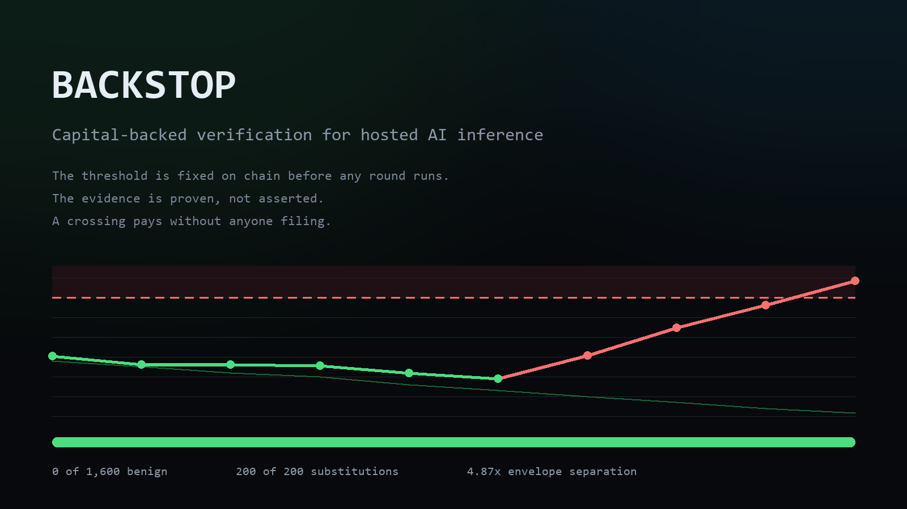
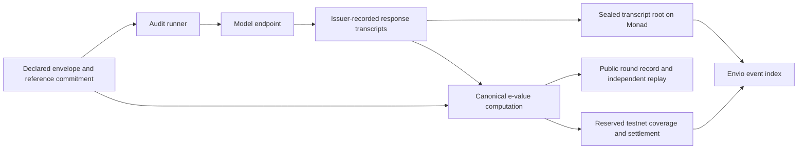

# BACKSTOP

**Turn a hosted model label into a claim you can test.**

BACKSTOP audits hosted inference against a behavioural envelope committed before testing.
It publishes evidence anyone can replay and demonstrates collateralised coverage on Monad testnet.

[See the detected swap](https://backstop-smoky.vercel.app/endpoint/6) ·
[Judge tour](https://backstop-smoky.vercel.app/judges) ·
[Browser verifier](https://backstop-smoky.vercel.app/verify) ·
[Developer guide](https://backstop-smoky.vercel.app/docs) ·
[Method](https://backstop-smoky.vercel.app/method)



## The result

I use BACKSTOP to audit my own Qwen3-1.7B inference experiment. The endpoint keeps the same model
label while changing from Q8_0 to Q4_K_M. BACKSTOP detects departure after three rounds of the
substituted configuration, while a Q8_0 control stays below the same precommitted boundary.

| Evidence | Recorded result | Inspect |
|---|---|---|
| Q8_0 control, v5 | 7 actual model rounds; final log M −0.5818 | [Control](https://backstop-smoky.vercel.app/endpoint/5) |
| Switched endpoint, v6 | Q8_0 at rounds 0–2; Q4_K_M from round 3; crossing at round 5; final log M 3.1231 | [Crossing](https://backstop-smoky.vercel.app/endpoint/6) |
| Model campaign | 13 rounds and 9,984 actual completions, recorded through 25 September | [Public evidence](https://github.com/Marc-Dvci/BACKSTOP/tree/live-data) |
| My testnet coverage | 3 policies settle 105,000 test bUSDC in one transaction, using 641,142 gas | [Transaction](https://testnet.monadexplorer.com/tx/0xa71f6ff2de31b210b4b7aa8a6e7d48ac68c72040f38900357949751869dc7542), [policy 5](https://backstop-smoky.vercel.app/policy/5) |
| Independent replay | All 13 verdicts, transcript roots and cumulative logs reproduce against Monad | [Verification](docs/results/evidence-audit-2026-10-03.json) |

Each actual round contains 768 requests: 96 per cell across 8 cells. The boundary is
ln(1/0.05) ≈ 2.9957. The repository also includes seeded and simulated measured-law fixtures
for fast, reproducible development. Coverage uses the freely mintable testnet asset bUSDC.

## Try it in five minutes

Open the [browser verifier](https://backstop-smoky.vercel.app/verify) to recompute a real crossing
or control round, verify its 768 recorded responses, reject an edited copy and compare the
commitments directly with Monad. No installation or wallet is required.

Use Node 22 and pnpm 9.15.9. These commands work with the public evidence and the local reference server.

```bash
corepack enable
corepack prepare pnpm@9.15.9 --activate
pnpm install --frozen-lockfile
pnpm build

# Replay the actual crossing round: seed chain, selected cells, proofs and arithmetic.
node scripts/live/replay.mjs --version 6 --round 5

# Verify all 768 issuer-recorded response transcripts against the sealed root and counts.
node scripts/live/verify-transcripts.mjs --version 6 --round 5

# Exercise the CLI against a local server sampling measured Qwen laws.
node scripts/ci-audit.mjs --rounds 6 --draws 96
```

The reference fixture keeps its control below the boundary and detects its substitution at
round 2. The actual model experiment detects the change at round 5, following the switch at round 3.

Verify the complete actual-model campaign and settled policies:

```bash
node scripts/verify-live-evidence.mjs
```

Build and verify a standalone CLI artifact in an empty directory:

```bash
node scripts/pack-cli.mjs
# Output: dist-npm/backstop-audit/backstop-audit-1.0.0.tgz
```

On Windows, use `pnpm.cmd` when PowerShell's script policy requires it.

## Add an audit to an evaluation pipeline

Commit a reference pool for the same model, serving envelope, probe battery and sampling rules
as the endpoint you evaluate. Start with an observation-mode report, then enable the release gate
for your validated configuration.

```yaml
- uses: Marc-Dvci/BACKSTOP/action@main # pin the reviewed commit for your pipeline
  with:
    attestation: attestations/my-endpoint.json
    pool: pools/my-endpoint.json
    api-key: ${{ secrets.PROBE_SCOPED_API_KEY }}
    rounds: 4
    fail-on-cross: "false"
```

Audit exit codes are 0 for no observed crossing, 1 for a crossing and 2 for an incomplete run.
Replay exits 0 when verification passes and 1 when a check fails. A campaign fixes its draw count
and lifetime at inception; its statistical process accumulates evidence over that campaign.
Use `--state endpoint.campaign.json` in the CLI, or `campaign-state` in the Action, to continue
one campaign across jobs. Retain the file and serialize those jobs. See the
[campaign guide](docs/CAMPAIGNS.md) for interrupted rounds, locking and the local-state trust model.

## How it fits together



| Component | Implemented contribution |
|---|---|
| Monad | Versioned attestations, ordered audit rounds, execution tickets, WebAuthn policy authorisation, reserved collateral and batch settlement |
| Canonical core | Integer arithmetic at 1e27 scale, reference commitments, probes, e-process engine and proof-checked replay |
| CLI and GitHub Action | Endpoint audits, machine-readable reports, replay, quotes and configurable release checks |
| ERC-8004 | Auditor agent 1824 records 13 actual-model round feedback entries against provider agent 1927 |
| Envio HyperIndex | Event-derived reliability, coverage and producer metrics; complete campaign backfill and dated public snapshot |
| WebAuthn and PRF vault | Domain-bound policy assertions, resident passkeys, PRF-derived encryption and complete encrypted export/import |
| Chainlink CRE | Resumable workflow, scheduled BLS-verified quicknet beacon, selective reference replay and tested report receiver |

The recorded deployment addresses preserve the September experiment. The current source adds
premium floors, committed seasoning, dispute propagation, safer accounting and an issuer-bond
recovery path after the complete campaign and its final challenge window.

## The method

BACKSTOP measures behavioural consistency with an enumerated serving envelope. Each round takes
the minimum e-value across permitted configurations and combines selected cells by their arithmetic
mean. Evidence accumulates in log space, with policy processes beginning at their own inception.

Under conditional exchangeability and valid conditional e-values, Ville's inequality bounds the
lifetime crossing probability by α. Known-law simulations exercise this setting; the measured
Qwen experiment demonstrates empirical separation and a controlled control-versus-substitution result.
Merkle proofs bind the published reference slices and issuer-recorded response bytes to their commitments.

[Measured results and regeneration commands](https://backstop-smoky.vercel.app/method)

## Build and verify

```bash
pnpm build
pnpm test
pnpm test:indexer
pnpm test:web
pnpm test:cre
pnpm typecheck
pnpm --filter @backstop/web build
forge test --root contracts -vv
```

`make install` installs the Foundry dependencies. `make demo` deploys on Anvil, uses a local
P256 verifier fixture and software-signed assertions, samples measured laws and settles a policy cohort.
The contract suite separately checks genuine P256 signatures and adversarial assertions.

The verification includes proof tampering, interrupted workflows, wallet cancellation, accounting,
seven stateful invariants, responsive browser journeys and concurrent RPC fallback.
[Recorded verification](docs/VERIFICATION_2026-10-04.md)

| Directory | Contents |
|---|---|
| `contracts/` | Protocol, CRE receiver, security, invariant and differential tests |
| `packages/` | Canonical core, SDK, CLI and producer |
| `apps/web/` | Evidence explorer, judge tour, coverage and encrypted claim vault |
| `scripts/live/`, `bench/` | Actual model experiment and measured serving laws |
| `indexer/`, `cre/` | Envio event index and CRE orchestration |
| `docs/` | Specification, results, verification and submission brief |

## Founder

Built solo by Marc Donovici, an information-systems and AI-governance auditor.
I built BACKSTOP because a supplier claim deserves a reproducible control and evidence another
person can check. My own inference experiments became the first use case: commit the claim,
measure the endpoint, replay the result, and inspect the consequence on chain.

The initial user is an evaluation team working with hosted open-weight models. The audit report
fits into its existing release pipeline; coverage adds an opt-in, collateralised consequence to
the same evidence.

[Submission brief](docs/SUBMISSION.md) · [MIT licence](LICENSE)
