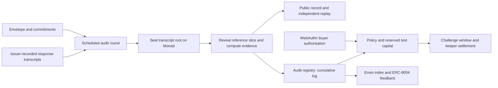

# BACKSTOP — submission brief

**One line:** Turn a hosted model label into a claim you can test: replayable inference audits and collateralised coverage on Monad testnet.

**Problem.** An evaluation is only as reliable as the system that produced it. An endpoint can keep the same model label while changing its serving configuration. Evaluation teams need a control they can repeat and evidence they can inspect throughout a model's use.

**Why I built it.** I'm Marc Donovici, an information-systems and AI-governance auditor. A supplier claim needs more than a label: it needs a declared system, a reproducible test and a reviewable result. I built BACKSTOP for my own inference experiments and use it to audit a controlled Qwen3-1.7B endpoint.

**What works.** The attestation commits the behavioural envelope, sampling rules, reference root and threshold before testing. BACKSTOP audits scheduled responses, seals transcript commitments on Monad and publishes proof-bearing reference slices. Its CLI recomputes the verdict using canonical integer arithmetic. The GitHub Action places that report in an evaluation pipeline. WebAuthn authorises coverage, the pool reserves the full notional, and a keeper settles a crossing cohort in one transaction.

**My measured use.** The published experiment contains 13 actual model rounds and 9,984 completions. Version 6 serves Q8_0 for rounds 0–2, switches to Q4_K_M at round 3 and crosses the committed boundary at round 5. The Q8_0 control stays below that boundary. My three policies settle 105,000 test bUSDC in one Monad transaction using 641,142 gas. Every actual-model round and recorded policy is independently verifiable.

**Why Monad.** The chain fixes the commitments, orders the audit stages and provides an inspectable settlement record. Canonical arithmetic keeps offchain replay and Solidity recomputation aligned. Bounded batches share the settlement work across a policy cohort. Each buyer's evidence begins at that policy's inception.

**Developer experience.** The browser verifier recomputes a real round, checks its 768 recorded responses, rejects an edited copy and independently compares the commitments with Monad. No wallet or installation is required. A no-key, no-GPU reference server exercises both control and substitution. The packed CLI installs independently of the monorepo. Its persistent campaigns and observation-mode GitHub Action retain evidence between serial jobs before a team enables a release gate for its validated model envelope.

**Built integrations.** ERC-8004 records 13 round feedback entries for the provider agent. Envio derives the reliability and coverage index from events and exposes the recorded campaign through GraphQL. The native WebAuthn PRF vault encrypts and exports claim state. Chainlink CRE includes a resumable workflow with scheduled, BLS-verified quicknet beacons, proof-checked reference slices and a tested report receiver.

**Initial user and business.** Hosted open-weight inference evaluation teams are the first wedge. Start with the audit report inside the team's existing pipeline, then offer monitored endpoints and opt-in coverage tied to the same declared envelope. BACKSTOP makes supplier accountability a reproducible developer workflow.

## Judge proof ledger

| Evidence | Inspect |
|---|---|
| Controlled crossing and Q8_0 control | [Version 6](https://backstop-smoky.vercel.app/endpoint/6), [version 5](https://backstop-smoky.vercel.app/endpoint/5) |
| Recompute and test tampering | [Browser verifier](https://backstop-smoky.vercel.app/verify) |
| My settled policy | [Policy 5](https://backstop-smoky.vercel.app/policy/5) |
| Batch payout | [Monad transaction](https://testnet.monadexplorer.com/tx/0xa71f6ff2de31b210b4b7aa8a6e7d48ac68c72040f38900357949751869dc7542) |
| All actual round records | [Public evidence branch](https://github.com/Marc-Dvci/BACKSTOP/tree/live-data) |
| Campaign verification | `node scripts/verify-live-evidence.mjs` |
| Local integration | `pnpm build` then `node scripts/ci-audit.mjs` |
| Engineering verification | [Recorded results](VERIFICATION_2026-10-04.md) |

## Architecture

