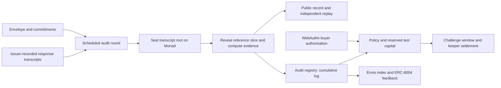

# BACKSTOP — submission brief

**One line:** Turn a hosted model label into a claim anyone can test: BACKSTOP commits an endpoint's behavioural envelope on Monad, audits it round by round, and publishes evidence anyone can replay.

**Track:** Trust, Identity & AI Infrastructure · **Live:** https://backstop-smoky.vercel.app/judges · **Code:** https://github.com/Marc-Dvci/BACKSTOP

**Videos:** [technical demo](https://youtu.be/nlv-WMvZcnE) · [founder pitch](https://youtu.be/sVpiR5unvmo)

## What it is

BACKSTOP is a verification primitive for hosted AI inference. Before testing begins, the issuer commits the endpoint's declared behavioural envelope, sampling rules, reference root and decision boundary on Monad. Each audit round seals the response transcripts onchain first, then reveals the reference slice with Merkle proofs. Anyone can recompute the verdict in the browser, with the CLI or in Solidity, using the same canonical integer arithmetic. Collateralised coverage is the reference application: a policy pays out from a fully reserved pool when the committed test crosses.

## The result

I ran BACKSTOP on my own Qwen3-1.7B endpoint. The model label stays the same while the serving configuration changes underneath it.

- **Version 6** serves Q8_0 for rounds 0–2, switches to Q4_K_M at round 3 and crosses the precommitted boundary at round 5, after three rounds of the substituted weights.
- **Version 5**, the Q8_0 control, stays below the same boundary for all 7 rounds.
- The campaign contains **13 actual model rounds and 9,984 completions**, recorded through 25 September. Each round contains 768 requests.
- **Three policies settle 105,000 test bUSDC in one Monad transaction**, using 641,142 gas.
- All 13 verdicts, transcript roots and cumulative logs reproduce independently against Monad.

## The problem

An evaluation describes the system that was evaluated. A hosted endpoint can keep the same model label while its quantisation, weights or serving stack change, and the benchmark number then describes something else. Evaluation teams need a control they can repeat, with evidence a third party can check.

## Why a protocol rather than an in-house eval script

An internal benchmark cannot show an outsider that the threshold and reference were fixed before the data arrived, or that every round was kept. BACKSTOP fixes them on a public chain before round 0 and seals every round's transcripts before its verdict. Verification needs only the published evidence and the chain, never a BACKSTOP server, so no single platform holds the record or decides the outcome.

## Trust primitives on Monad

- **Passkeys via Monad's P256 precompile.** Coverage purchases are authorised by WebAuthn assertions. The full ceremony is verified onchain over the precompile at `0x0100`, with each signature bound to the buyer and the coverage terms.
- **ERC-8004 agent identity.** The issuer is agent 1824 on the Monad testnet registry. Each of the 13 rounds records feedback for provider agent 1927.
- **Passkey PRF vault.** One passkey derives three separate namespaces, none of them a wallet. They encrypt and export claim state, which imports again with the same PRF-enabled passkey.
- **Canonical arithmetic.** Fixed-point integer arithmetic keeps browser replay, CLI replay and Solidity recomputation identical.

## Developer experience

- **Zero-install verifier.** The browser verifier recomputes a real round, checks its 768 recorded responses, compares the commitments directly with Monad and rejects an edited copy. No wallet or installation is needed.
- **One-command replay.** `make replay-live` recomputes the crossing round from its published record.
- **No-key reference server.** It needs no API key and no GPU, and serves laws measured from the real model, so the CLI catches a substitution on any laptop.
- **GitHub Action.** It reports a verdict in observation mode first, keeps campaign state between pipeline jobs, and can then gate a release. A scheduled workflow in the repository runs it every hour against both configurations of the reference endpoint and has completed 140 green runs.
- **Tests.** 117 JavaScript cases and 88 Solidity tests, including seven stateful accounting invariants exercised across 8,192 calls.

## Sponsor integrations

- **Envio.** A self-hosted HyperIndex indexer folds the contract events into the reliability and coverage index: realised loss ratio, detection delay and void rate. `/protocol` prints the GraphQL query that produced each figure.
- **Dynamic.** Dynamic is the signer for every transaction in the app: email sign-in into an embedded wallet, or an external wallet, landing on Monad testnet.
- **Chainlink CRE.** The repository includes a resumable CRE workflow that advances a round through open, seal and close, with BLS-verified drand quicknet beacons and proof-checked reference slices. It compiles with the official CRE toolchain, and its scenario harness passes 12 cases.

## Who adopts it first

The first users are teams evaluating hosted open-weight models. They already run evaluations, and they need to know when the endpoint they evaluated stops being the system they evaluated. Adoption starts with an observation-mode report inside the pipeline they already have. Monitored endpoints and opt-in coverage, tied to the same declared envelope, follow once the report has earned trust.

## Why I built it

I'm Marc Donovici, an information-systems and AI-governance auditor. In an audit, a supplier claim needs a declared system, a reproducible test and a result someone else can review. I built BACKSTOP to apply that discipline to my own inference experiments, and its first audited endpoint is mine.

## Next steps after the event

1. Publish the CLI on npm and the Action on the GitHub Marketplace at pinned versions.
2. Onboard evaluation teams in observation mode, on endpoints they already evaluate, so each one receives a replayable report.
3. Add TLS or TEE provenance for producer responses, so that the serving stack, rather than the issuer, authenticates the observations.
4. Build issuance-bound dispute adjudication and an economic model for coverage before any real-value deployment.

## Judge proof ledger

| Evidence | Inspect |
|---|---|
| Start here | [Judge tour](https://backstop-smoky.vercel.app/judges) |
| Controlled crossing and Q8_0 control | [Version 6](https://backstop-smoky.vercel.app/endpoint/6), [version 5](https://backstop-smoky.vercel.app/endpoint/5) |
| Recompute and test tampering | [Browser verifier](https://backstop-smoky.vercel.app/verify) |
| My settled policy | [Policy 5](https://backstop-smoky.vercel.app/policy/5) |
| Batch payout | [Monad transaction](https://testnet.monadexplorer.com/tx/0xa71f6ff2de31b210b4b7aa8a6e7d48ac68c72040f38900357949751869dc7542) |
| All actual round records | [Public evidence branch](https://github.com/Marc-Dvci/BACKSTOP/tree/live-data) |
| Campaign verification | `node scripts/verify-live-evidence.mjs` |
| Local integration | `pnpm build` then `node scripts/ci-audit.mjs` |
| Engineering verification | [Recorded results](VERIFICATION_2026-10-04.md) |

## Architecture

